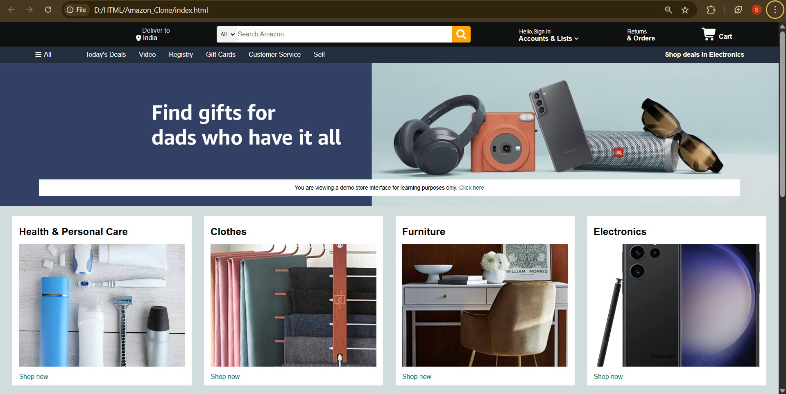
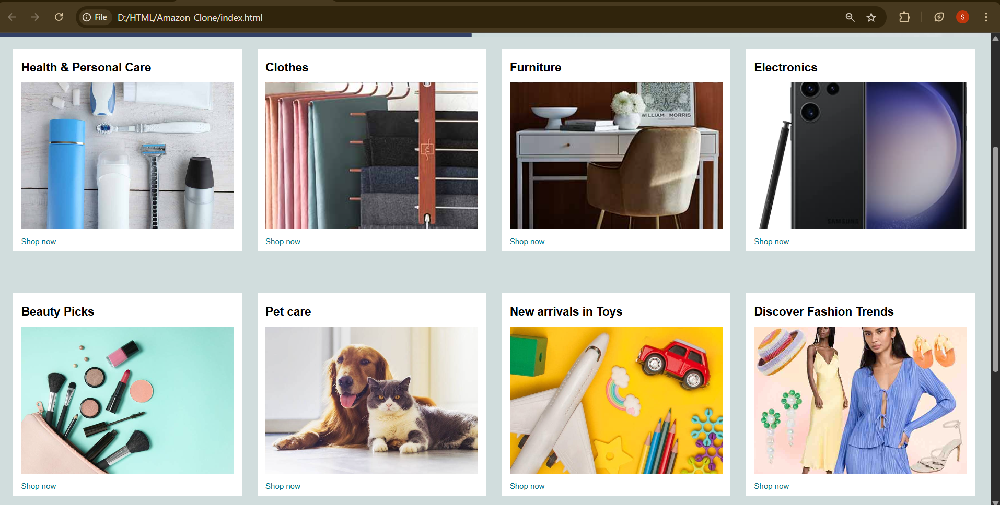
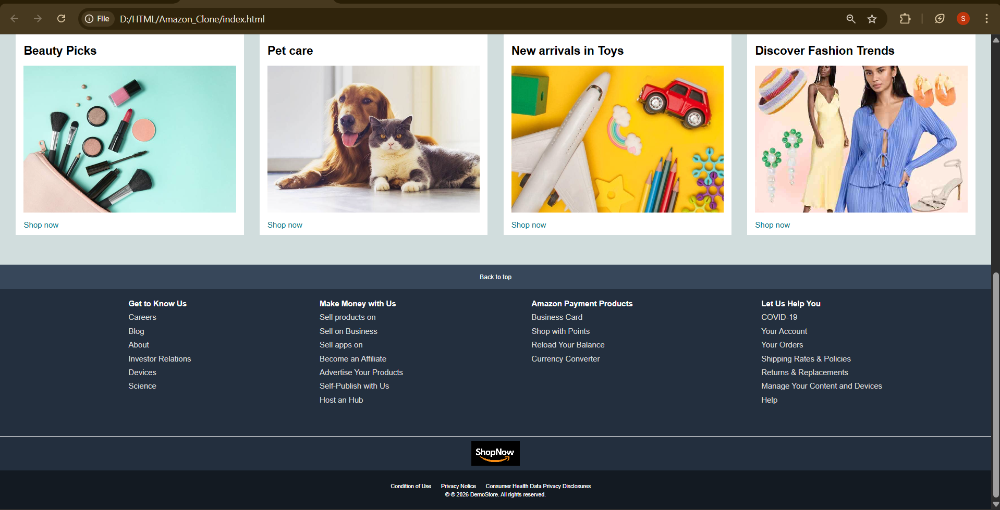

# E-Commerce-UI-Clone-Demo (HTML + CSS)

## 📌 Overview
**E-Commerce-UI-Clone-Demo** is a **static front-end clone of a modern e-commerce homepage**, built entirely using **HTML and CSS**.

This repository contains a **complete e-commerce UI layout**, including a navigation bar, secondary menu panel, hero section, product shop sections, and a fully structured multi-level footer.  
The purpose of this project is to practice **real-world UI layout replication**, page structuring, and styling using **pure HTML and CSS**, without JavaScript.

This is a **UI-focused clone**, not a functional e-commerce application.

---

## 🎯 Objectives
- Build a complete real-world webpage using HTML & CSS  
- Strengthen Flexbox layout and alignment skills  
- Practice reusable UI component design  
- Implement hero sections with overlay text  
- Create multi-section and multi-column footers  
- Understand large-scale front-end structuring  

---

## 🚀 Live Demo
🔗 [View Live Demo](https://shreyaawari28.github.io/E-Commerce-UI-Clone-Demo/)

---

## 📸 Outputs

---

## 🧠 Features Implemented
- Modern top navigation bar  
- Logo, delivery location, search bar, account, orders, and cart sections  
- Secondary navigation panel with menu and category options  
- Hero section with background image and informational banner  
- Product shop section with multiple category cards  
- Card layout implemented using Flexbox with wrapping  
- Reusable card components for scalability  
- “Back to top” footer panel  
- Multi-column footer with informational links  
- Footer branding section  
- Legal and copyright section  
- Hover effects and consistent e-commerce color theme  

---

## 🧪 How It Works
- **Header & Navbar**: Flexbox-based horizontal alignment  
- **Panel Section**: Secondary navigation menu  
- **Hero Section**: Full-width background with overlay text  
- **Shop Section**: Card-based layout using Flexbox and `flex-wrap`  
- **Footer**: Multi-layer structure with links and branding  

All layout and styling are handled entirely using CSS.

---

## ⚠️ Limitations
- No JavaScript functionality  
- Search bar, links, and buttons are non-functional  
- Not fully responsive on small devices  
- Static UI built strictly for practice  

---

## ⚠️ Disclaimer
This project is created **strictly for educational purposes**.  
It is **not affiliated with any real brand or company**.

---

## 👨‍💻 Author
**Shreya Awari**  
📧 Email: shreyaawari31@gmail.com  
🌐 GitHub: https://github.com/shreyaawari28
